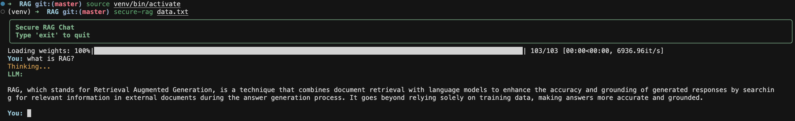

# Secure RAG

**Secure RAG** is a privacy-aware Retrieval-Augmented Generation framework for local document intelligence.

Its key research contribution is **Pre-Embedding Privacy Enforcement**, where sensitive information is detected and masked **before chunking, embedding, and vector indexing**, ensuring private data never enters the retrieval pipeline in raw form.

This allows the framework to preserve privacy while maintaining semantic retrieval quality for grounded question answering.

---

# Why Secure RAG

- Privacy-aware query and context masking
- **Pre-Embedding Privacy Enforcement**
- Support for `.txt` and `.pdf` inputs
- FAISS-backed semantic retrieval
- True streaming answer generation
- Lazy loading for embedding and API clients
- Packaged Python API and CLI entry point
- Research-ready architecture for medical and enterprise RAG

---

# Demo

Place README images in `docs/images/`.

Recommended files:

- `docs/images/demo-cli.png`
- `docs/images/demo-architecture.png`
- `docs/images/demo-streamlit.png`

## CLI Demo


The screenshot above shows the packaged terminal chat flow after indexing `data.txt`, including model loading, query entry, and streamed answer output.

---

# Architecture

Secure RAG follows a privacy-first retrieval pipeline:

1. Load a local document from `.txt` or `.pdf`
2. Parse and validate input
3. Apply privacy masking before vectorization
4. Split the document into overlapping chunks
5. Convert chunks into embeddings
6. Index embeddings in FAISS
7. Mask the user query before retrieval
8. Retrieve relevant chunks
9. Mask retrieved context before generation
10. Stream the grounded response back to the caller

This design ensures sensitive entities can be protected **before entering the vector store**, which is the framework’s core research contribution.

---

# Research Direction

Core Contribution

Pre-Embedding Privacy Enforcement

The framework is being evolved toward privacy-preserving local RAG for medical and enterprise-sensitive workflows, where private entities are protected before vectorization.

Planned research extensions
	•	medical PHI masking
	•	spaCy / Presidio NER masking
	•	citation-aware retrieval
	•	privacy leakage benchmarking
	•	retrieval quality tradeoff studies
	•	medical-safe internal demos


# Installation

## From PyPI
```bash
pip install secure-rag

